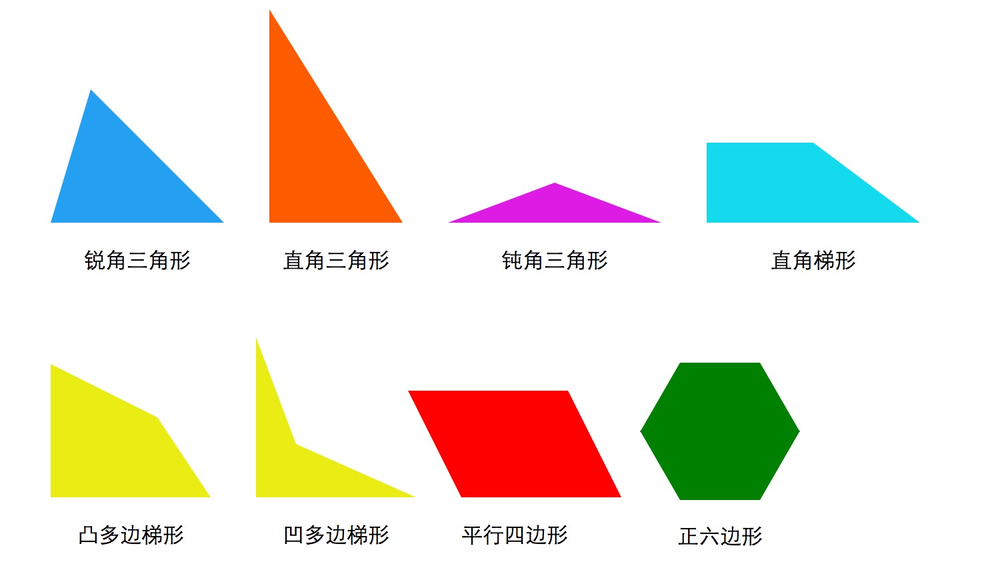

#border属性的特点以及实际的应用场景

border属性是在实际的应用中使用频率比较高的一个属性。利用border属性的一些特征以及表现方式，可以在实现一些比较常见的效果（如等高布局，上下固定内容滚动布局），利用css3新增的属性值（如使用图片填充边框）可以实现一些更复杂的效果。   
   
###一、border的特点
1. border中的`border-style`可选值为 `solid(实线)`， `dotted(点)` `dashed(虚线)`， `double(双线)`,此外还有`inset`, `outset`, `groove`, `ridge`等3D效果的边框，目前在实际项目中，用的比较多的是`solid`和`dashed`。   

2. border中的`border-width`的值可以是`thin`,`medium`,`thick`以及数值如（2px）,浏览器的默认值是medium，用js获取这个值时是3px。但是border属性值不支持百分比数值。

3. border中`border-color`支持的值也是颜色名称（如red），十六进制值（如#F00），rbg/rgba（如rgb(255,0,0)）和`transparent`。如果不指定颜色，将会以当前元素的文字颜色值作为默认值。

###二、border的应用
1. 利用border画三角形和梯形等   
在CSS中，没有哪个属性是可以将一个元素修饰为三角形。但是，我们利用border在渲染时的一些表现特点可以画出三角形，梯形等。以下讲解如何一步一步得到三角形。
首先我们定义一个div，样式如下   

```css
 .border {
 	width: 200px;   
 	height:100px;   
 	margin:0 auto;   
 	border-top:40px solid red;   
 	border-bottom:40px solid green;   
 	border-left: 40px solid yellow;   
 	border-right: 40px solid blue;   
 }
```

浏览器渲染后效果如下：   


我们发现，通过定义给div的四个边框定义不同的颜色，我们发现其渲染后的表现形式为四个梯形组成的边框。
如果我们把高度定义为0，那么渲染后如下：   


如果我们再把宽度定义为0，结果如下：


通过对比以上定义的不同的样式，我们发现，在CSS中，边框的表现实际上以梯形的形式来渲染的（这可能与`groove`等3D效果的属性值有关）。当元素的宽高为0时就会变成挤在一起的四个三角形。因此，我们可以想到，如果把其中的三个边框的颜色定义为透明色`transparent`,。然后通过包裹在一个外层容器上，并给外层容器设置overflow:hidden，那么我们将得到一个等腰梯形或者三角形。现在我们把css修改为以下内容。 
  

```css
 .trapezoid {
 	width: 200px;   
 	height:0;      
 	border-top:none;   
 	border-bottom:60px solid #249ff1;   
 	border-left: 40px solid transparent;   
 	border-right: 40px solid transparen;   
 }
```
我们将得到以下梯形：


将样式设置为如下：

```css
 .triangle {
 	width:0;
 	height:0;
 	border-top:0 solid transparent;
 	border-bottom:100px solid #249ff1;
 	border-left: 100px solid transparent;
 	border-right: 100px solid transparent;
 }
```
我们将得到以下三角形：


有了这种表现形式的基础，我们可以通过设置不同边框宽度值、颜色以及借住伪元素或者多个元素的拼接可以实现更为复杂的一些图形，比如多角星，菱形，多边形以及我们常见的聊天气泡等。如下为其中几个例子[你可以点击此处查看源代码](./demos/border/more.html)。




 


